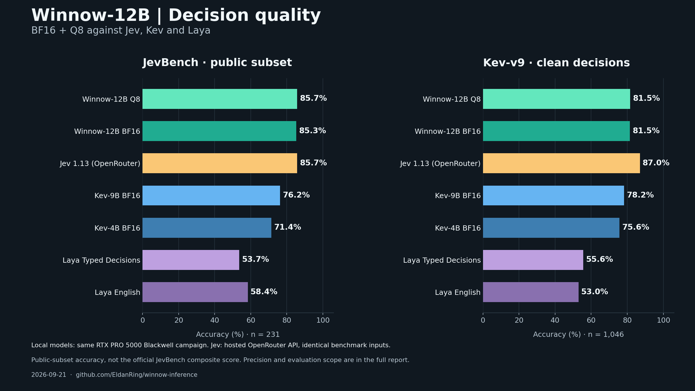

# Winnow-12B inference

A native llama.cpp server for local typed decisions and regular chat, sharing one
loaded model. `/v1/systemone` evaluates `noul`, `choice`, and `score` questions
against a shared state. `/v1/chat/completions` retains llama-server's chat, vision,
and streaming interfaces.

**64K context and vision on a 16 GB RTX 5070 Ti**, with Q8 weights fully on the
GPU. Winnow-12B is a fine-tune of Gemma 4 12B; the same loaded model serves typed
decisions and regular chat.

[Model weights and model card](https://huggingface.co/EldanRing/Winnow-12B) ·
[Benchmarks](docs/BENCHMARKS.md) · [API](docs/API.md) ·
[Installation](docs/INSTALL.md)

On the 231-item public JevBench subset, **Winnow-12B Q8 matched hosted Jev at
85.7% (198/231)**; Winnow-12B BF16 scored 85.3%. Local-model comparisons use the
same RTX PRO 5000 Blackwell. See the [full benchmark report](docs/BENCHMARKS.md).



Merged BF16 weights, Q8 GGUF, and the matching vision projector are separate
downloads. The training dataset is private. Exact release checksums are in
[the model manifest](manifests/models.json).

## Quickstart

Supported: **Linux + NVIDIA GPU** (the measured profile uses a 16 GB RTX 5070 Ti)
or **Apple Silicon Mac** (24 GB or more unified memory for the documented profile).
Use a terminal to start the local API server.

### 1. Get the code and prerequisites

```sh
git clone https://github.com/EldanRing/winnow-inference.git
cd winnow-inference
```

**Apple Silicon Mac — native Metal + Accelerate:**

```sh
xcode-select --install
brew install python cmake openssl@3
```

Wait for Xcode command-line tools to finish installing. The `brew` command assumes
[Homebrew](https://brew.sh) is installed. Setup locates its OpenSSL automatically.

**Linux/NVIDIA — native CUDA:**

```sh
sudo apt-get install build-essential cmake git python3 libssl-dev
```

Install a compatible NVIDIA driver and the [CUDA toolkit](https://developer.nvidia.com/cuda-downloads).
A driver alone is not enough; Blackwell needs CUDA 12.8 or newer. The setup script
checks that your toolkit supports your GPU before it downloads anything.

### 2. Set up Winnow

```sh
python3 scripts/setup.py
```

This checks prerequisites **before downloading**, selects your platform profile,
downloads the pinned Q8 model and vision projector (about **12.85 GB**), verifies
both checksums, and builds the server. No Hugging Face CLI, Python packages,
API key, or paid service is required. Interrupted downloads resume when you rerun
the command. Initial setup time depends on your internet connection and CPU;
subsequent launches reuse the files. It does not install system packages for you.

### 3. Start the server

```sh
python3 scripts/serve.py
```

Defaults use the downloaded files with vision and the platform profile:
`5070ti-64k` on Linux, `apple-silicon` on macOS. The server listens on
**http://127.0.0.1:8091**. Leave this terminal running; Ctrl+C stops the server.

### 4. Get your first response

In a **second terminal**, change to the same repository folder and run:

```sh
python3 examples/client.py
```

The example prints both typed decisions and a regular chat response. For a single
decision request:

```sh
curl http://127.0.0.1:8091/v1/systemone \
  -H 'Content-Type: application/json' --data-binary @examples/decisions.json
```

Existing model files: `python3 scripts/setup.py --model-dir /path/to/models`,
then `python3 scripts/serve.py --model-dir /path/to/models`. Keep the `gguf/`
subdirectory. Custom files can still use `--model` and `--mmproj` directly.
Text-only users can add `--text-only` to both setup and launch.

### Profiles and adjustments

| Profile | Context | Vision | Decision branches | KV cache |
|---|---:|---|---:|---|
| `5070ti-64k` | 65,536 | Yes | 4 | Q8 |
| `apple-silicon` | 65,536 | Yes | 1 | F16 |

```sh
python3 scripts/serve.py --profile apple-silicon  # Mac
python3 scripts/serve.py --profile 5070ti-64k     # NVIDIA
# Explicit settings override your platform profile:
python3 scripts/serve.py --context 32768
```

Both profiles use exclusive context scheduling: chat and decisions share the
loaded weights, queue when necessary, and release the idle API's KV cache when
switching. Context includes formatting, image positions, questions and replies.
The Mac capacity measurement used an earlier checkpoint; see the
[validation report](docs/VALIDATION.md). Other GPUs may need different settings.

[Full installation and troubleshooting](docs/INSTALL.md) ·
[API, vision and concurrency](docs/API.md) · `python3 scripts/serve.py --help`

## Verify your setup

A short, repeatable release check starts and stops its own authenticated local
servers, including selected/full-head comparison:

```sh
python3 scripts/release_check.py --model models/gguf/Winnow-12B-Q8_0.gguf \
  --mmproj models/gguf/mmproj-F16.gguf --context 65536 \
  --decision-parallel 4 --memory exclusive --output results/release-smoke
```

It uses a 4,096-token output allowance and does not run a quality benchmark or
context sweep. Add `--long-context` explicitly for capacity confirmation.
For an already running server, use the individual checks below. Authenticated
servers are supported through `WINNOW_API_KEY_FILE` or `WINNOW_API_KEY`.

```sh
python3 scripts/check.py --output results/check --vision
python3 scripts/check.py --output results/64k --vision --long-context 65536 --image-size 1536
python3 scripts/bench.py --output results/timings --repeats 5
python3 scripts/parity.py --output results/selected
```

Restart with `--head full`, then use `scripts/parity.py --output results/full
--compare results/selected` to verify selected-head probabilities. The full-head
mode is a reference implementation; normal chat always retains its full head.
All scripts save requests and responses locally. These focused probes validate
runtime behavior and timings, not general model quality or calibrated confidence.

## Container

GPU execution requires a Linux Docker engine configured with the
[NVIDIA Container Toolkit](https://docs.nvidia.com/datacenter/cloud-native/container-toolkit/latest/install-guide.html).
Building the image alone does not require GPU access.

```sh
docker build --build-arg CUDA_ARCH=120 -t winnow-inference .
docker run --rm --gpus 'device=0' -p 127.0.0.1:8091:8091 \
  -v /path/to/models:/models:ro winnow-inference \
  --model /models/gguf/Winnow-12B-Q8_0.gguf --mmproj /models/gguf/mmproj-F16.gguf \
  --context 65536 --cache q8_0 --decision-parallel 4 \
  --chat-parallel 1 --memory exclusive
```

The Docker build context includes public source files only. The container uses a
pinned CUDA image and runs as an unprivileged user. It does not download weights
or embed credentials. Local native builds are the validated serving path; the
container's separate build status is recorded in the report.

## Source layout

- `native/`: protocol, prefix/branch planner, selected-answer engine and queue bridge.
- `patches/`: small, auditable changes to the pinned llama.cpp runtime/server.
- `scripts/`: dependency-free build, launch and validation tools.
- `tests/`: protocol/planner tests and public synthetic runtime probes.
- `manifests/`: artifact identity and release status.

[Maintainer checks](docs/RELEASE.md) cover automated checks and clean source
packaging.

The code is MIT licensed. Model weights retain their own model terms. Nothing is
published automatically by these scripts.
