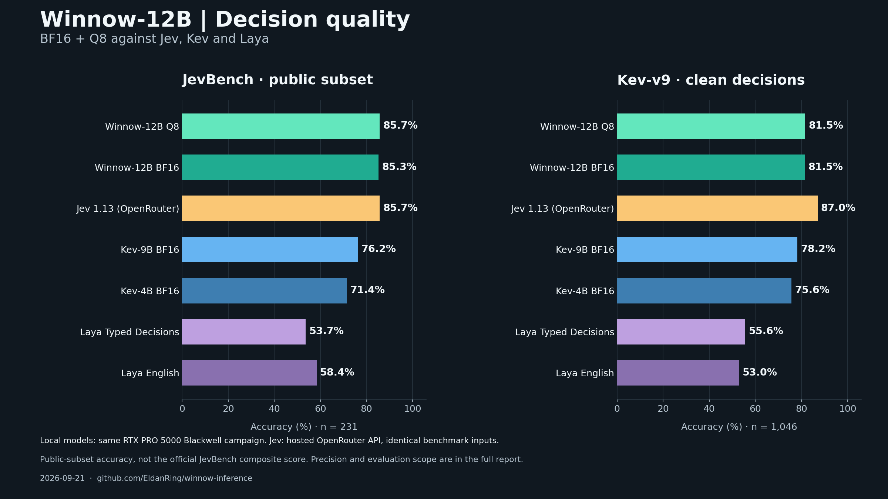
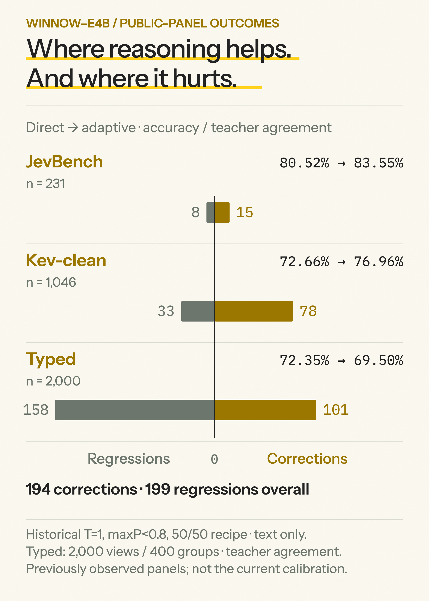

# Winnow-12B inference

A native llama.cpp server for local typed decisions and regular chat, sharing one
loaded model. `/v1/systemone` evaluates `noul`, `choice`, and `score` questions
against a shared state. `/v1/chat/completions` retains llama-server's chat, vision,
and streaming interfaces.

Native **NVIDIA CUDA** and **Apple Silicon Metal + Accelerate** backends expose
the same decision, chat and vision APIs.

This release also contains an **explicitly experimental** adaptive
decision client. Direct decisions remain the default. The optional Linux/CUDA
text-only mode uses verified model artifacts and optional matching MTP assistants and frozen model-specific
policies; it is not an accuracy-preservation guarantee.
See [the adaptive contract and limits](docs/ADAPTIVE.md).

**2026.10.05 client compatibility patch:** adaptive decisions now accept one
text, object, or array state while keeping images unsupported. Existing direct
decisions, model weights, server binary, and frozen policy constants are unchanged.
See the [patch release and upgrade instructions](https://github.com/EldanRing/winnow-inference/releases/tag/v2026.10.05).

**64K context and vision on a 16 GB RTX 5070 Ti**, with Q8 weights fully on the
GPU. Winnow-12B is a fine-tune of Gemma 4 12B; the same loaded model serves typed
decisions and regular chat.

[Model weights and model card](https://huggingface.co/EldanRing/Winnow-12B) ·
[Benchmarks](docs/BENCHMARKS.md) · [API](docs/API.md) ·
[Installation](docs/INSTALL.md)

On the 231-item public JevBench subset, **Winnow-12B Q8 matched hosted Jev at
85.7% (198/231)**; Winnow-12B BF16 scored 85.3%. Local-model comparisons use the
same RTX PRO 5000 Blackwell. See the [full benchmark report](docs/BENCHMARKS.md).



BF16 GGUF, Q8 GGUF, and the matching vision projector are separate
downloads. The training dataset is private. Exact release checksums are in
[the model manifest](manifests/models.json).

## Reasoning results

### Q8 reasoning on Jev: 192-token historical experiment

| 12B Q8 method | Correct / 231 | Accuracy |
|---|---:|---:|
| Native direct | 198 | 85.71% |
| Same-model reasoning, MTP off | 208 | 90.04% |
| Same-model reasoning, MTP draft depth 1 | 209 | 90.48% |

This all-cases, 192-token recipe scored partial text and used no gate or blend;
it is **not** the released `q8-fixed50-v1` policy or its separate 96-decision pilot.
The MTP variant was faster but regressed from 83/96 to 81/96 on an external panel.
[Full Q8 benchmark, completion handling, probability losses and timing](docs/REASONING-RESULTS.md#q8-reasoning-on-the-full-jev-public-subset).

### Historical NVFP4 and E4B comparison

A historical text-only experiment added same-model reasoning below a raw confidence
threshold, then blended direct and augmented probabilities equally. It improved
Jev and Kev-clean results but reduced Typed teacher agreement (direct → adaptive):

| Historical model / recipe | Jev, 231 | Kev-clean, 1,046 | Typed agreement, 2,000 |
|---|---:|---:|---:|
| 12B NVFP4, fixed gate | 83.55 → 87.88% | 77.82 → 81.45% | 70.60 → 70.15% |
| E4B Q8, fixed gate | 80.52 → 83.55% | 72.66 → 76.96% | 72.35 → 69.50% |

These historical recipes differ from the released NVFP4 entropy and E4B calibrated
policies. Full-router means were 347 ms and 234 ms; their included direct HTTP calls
averaged 51 ms and 37 ms. Later E4B calibration improved probability losses with
little agreement change; the small Q8 confirmation remained inconclusive.
[See full counts, policy comparisons, latency definitions and MTP limits](docs/REASONING-RESULTS.md).
Direct decisions remain the default.



## Quickstart

[Choose direct decisions, reasoning and MTP](docs/QUICKSTART.md) with one model selector
and explicit on/off switches. The guide covers verified downloads, source setup,
the thin runtime, and supported combinations for 12B Q8, 12B NVFP4 and E4B Q8.


Supported: **Linux + NVIDIA GPU** (the measured profile uses a 16 GB RTX 5070 Ti)
or **Apple Silicon Mac** (24 GB or more unified memory for the documented profile).
Use a terminal to start the local API server.

### 1. Get the code and prerequisites

```sh
git clone https://github.com/EldanRing/winnow-inference.git
cd winnow-inference
```

**Apple Silicon Mac — native Metal + Accelerate:**

```sh
xcode-select --install
brew install python cmake openssl@3
```

Wait for Xcode command-line tools to finish installing. The `brew` command assumes
[Homebrew](https://brew.sh) is installed. Setup locates its OpenSSL automatically.

**Linux/NVIDIA — native CUDA:**

```sh
sudo apt-get install build-essential cmake git python3 libssl-dev
```

Install a compatible NVIDIA driver and the [CUDA toolkit](https://developer.nvidia.com/cuda-downloads).
A driver alone is not enough; Blackwell needs CUDA 12.8 or newer. The setup script
checks that your toolkit supports your GPU before it downloads anything.

### 2. Choose a preset and set up

```sh
python3 scripts/winnow.py presets
python3 scripts/winnow.py setup --model q8
```

Short presets are `q8`, `nv4` and `e4b`. Each defaults to 8K text with MTP and
reasoning off. Setup checks prerequisites, downloads verified weights and builds.
It does not install system packages. Existing valid downloads are reused.

### 3. Start and query

```sh
python3 scripts/winnow.py serve --model q8 --context 8k
# In a second terminal:
python3 scripts/winnow.py decide --model q8 --input examples/decisions.json
```

Select `--vision on`, `--mtp on` or `--reasoning on` explicitly; download the
matching assets first with the same flags. Context and numerical settings can be
overridden where supported. The [quickstart](docs/QUICKSTART.md) includes the mode
matrix, memory estimates, measured baselines and examples. Changed configurations
do not inherit the measured calibration or performance claims.

The server uses **http://127.0.0.1:8091**. Leave its terminal running; Ctrl+C stops
it. Direct clients verify the chosen model and quantization. Use `--model-dir`
for another verified asset directory. The existing `scripts/serve.py` remains
available for custom GGUF paths and legacy platform profiles.

[Full installation and troubleshooting](docs/INSTALL.md) ·
[API, vision and concurrency](docs/API.md) · `python3 scripts/winnow.py --help`

## Verify your setup

For the default **12B Q8 text-only, 8K** setup above, this short release check
starts and stops its own authenticated local servers, including selected/full-head
comparison. These model paths are Q8-specific; they do not select E4B or NVFP4:

```sh
python3 scripts/release_check.py --model models/gguf/Winnow-12B-Q8_0.gguf \
  --context 8192 --memory exclusive --output results/release-smoke-text
```

It uses a 4,096-token output allowance and does not run a quality benchmark or
context sweep. For an already running text server, use the individual checks:

```sh
python3 scripts/check.py --output results/check
python3 scripts/bench.py --output results/timings --repeats 5
python3 scripts/parity.py --output results/selected
```

For the optional **12B Q8 64K vision** check, first download the projector explicitly.
Use a host that meets the [64K platform requirements](docs/INSTALL.md):

```sh
python3 scripts/winnow.py download --model q8 --vision on
python3 scripts/release_check.py --model models/gguf/Winnow-12B-Q8_0.gguf \
  --mmproj models/gguf/mmproj-F16.gguf --context 65536 \
  --memory exclusive --output results/release-smoke-vision
```

Add `--long-context` to that release check explicitly for capacity confirmation.
The following probes require an already running **64K vision** server, launched
with the matching platform command in [INSTALL](docs/INSTALL.md):

```sh
python3 scripts/check.py --output results/check-vision --vision
python3 scripts/check.py --output results/64k --vision --long-context 65536 --image-size 1536
```

Authenticated servers are supported through `WINNOW_API_KEY_FILE` or `WINNOW_API_KEY`.

Restart with `--head full`, then use `scripts/parity.py --output results/full
--compare results/selected` to verify selected-head probabilities. The full-head
mode is a reference implementation; normal chat always retains its full head.
All scripts save requests and responses locally. These focused probes validate
runtime behavior and timings, not general model quality or calibrated confidence.

## NVIDIA container

Build the container locally on Linux. GPU execution requires Docker Engine with
the [NVIDIA Container Toolkit](https://docs.nvidia.com/datacenter/cloud-native/container-toolkit/latest/install-guide.html)
and a CUDA 13.0-compatible driver. Apple Silicon uses native Metal above.

For RTX 50-series / SM120, download both **12B Q8 and its vision projector**
before starting the default 64K vision container:

```sh
python3 scripts/winnow.py download --model q8 --vision on
docker build --build-arg CUDA_ARCH=120 -t winnow-inference .
docker run --rm --gpus 'device=0' -p 127.0.0.1:8091:8091 \
  -v "$PWD/models:/models:ro" winnow-inference
```

The default is the 5070 Ti 64K + vision profile. For a complete container-only
setup, including downloading weights without host Python, follow
[the container quickstart](docs/INSTALL.md#nvidia-container).
Other NVIDIA architectures can build the Dockerfile with their own `CUDA_ARCH`.

The runtime image is about **1.7 GB** uncompressed, excludes model weights and
build tools, and runs as an unprivileged user. Its exact server binary passed
local GPU API/chat/vision/parity checks. GPU execution inside Docker could not
be exercised on our Docker Desktop host because NVIDIA container support is not
configured; this validation limit is separate from the tested native path.

## Source layout

- `native/`: protocol, prefix/branch planner, selected-answer engine and queue bridge.
- `patches/`: small, auditable changes to the pinned llama.cpp runtime/server.
- `scripts/`: dependency-free build, launch and validation tools.
- `tests/`: protocol/planner tests and public synthetic runtime probes.
- `manifests/`: artifact identity and release status.

[Maintainer checks](docs/RELEASE.md) cover automated checks and clean source
packaging.

The code is MIT licensed. Model weights retain their own model terms. Nothing is
published automatically by these scripts.
