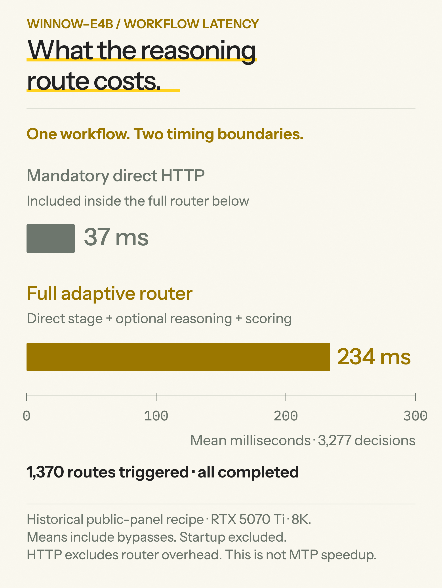
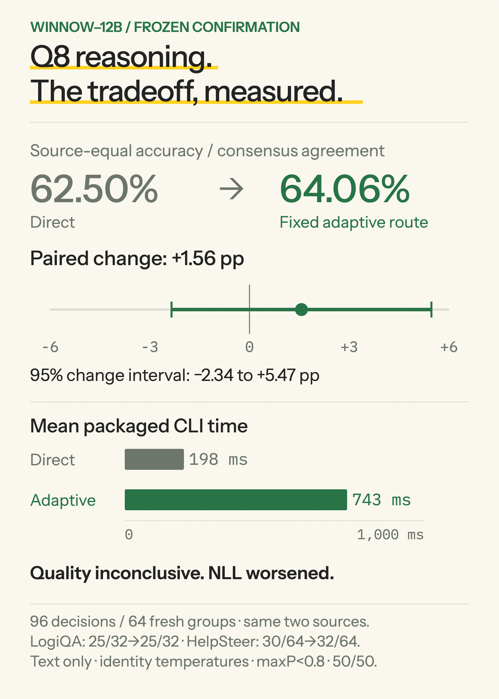

# Reasoning results and tradeoffs

Optional generated context improved some measured decision tasks and worsened others. Direct native decisions remain the default. This page separates the historical public-panel experiment from later evidence for the released policies; the recipes, comparators and timing boundaries differ.

[Run reasoning](QUICKSTART.md#download-and-launch) · [Policy contract](ADAPTIVE.md) · [Aggregate measurements](reasoning-results.json) · [Direct-decision benchmarks](BENCHMARKS.md)

## Q8 reasoning on the full Jev public subset

**Winnow-12B Q8 scored 198/231 direct, 208/231 with capped reasoning, and 209/231 with the historical MTP variant.** This is the full 231-question Jev public subset (195 scenario groups), separate from the later 96-decision LogiQA2/HelpSteer2 confirmation below. Jev public-subset accuracy is not the official composite leaderboard score.

| Historical Q8 method | Correct / 231 | Accuracy | Paired corrections / regressions vs direct | NLL | Brier |
|---|---:|---:|---:|---:|---:|
| Native direct | 198 | 85.71% | — | 0.382683 | 0.208570 |
| Reasoning, 192-token cap, MTP off | 208 | 90.04% | 19 / 9 | 0.398819 | 0.179645 |
| Reasoning, 192-token cap, MTP draft depth 1 | 209 | 90.48% | 20 / 9 | 0.357502 | 0.155337 |

The improvements versus direct are +4.33 and +4.76 percentage points. MTP versus the non-MTP reasoning reference had two corrections and one regression. The non-MTP arm's higher accuracy accompanied worse NLL than direct; these are different quality measures. Brier sums squared error over candidate classes, then averages decisions.

### Recipe and completion handling

This historical recipe generated ordinary-template analysis for **every case**, then appended it to the state and rescored with the same merged Q8 model through the native endpoint at temperature 1. There was **no confidence gate, probability blend, fitted temperature, or incomplete-generation fallback**. State/question inputs and candidate mappings were preserved; gold labels and benchmark rationales were absent from generation prompts.

Generation used temperature 0, seed 314159, a hard 192-token ceiling, a soft 100-word instruction, cache disabled and `reasoning_effort: none`. The non-MTP run had **31/231 capped/truncated outputs**; MTP had **28/231**. Both retained and scored partial text. Empty outputs and failed quality requests were zero. The semantic validity of every analysis was not independently adjudicated.

Both used an RTX 5070 Ti, text-only 8K contexts, Q8 KV, four native branches, one chat slot, selected-head scoring, batch 2048 and microbatch 1024. The initial non-MTP experiment used exclusive memory; a saved automatic-memory rerun preserved every generated trace and all 208 correct decisions. The isolated resident MTP variant used automatic memory, the matching official BF16 assistant, **maximum draft length 1**, minimum 0 and p-min 0. This is not the later MTP4 configuration.

**These numbers do not measure today's `q8-fixed50-v1` client.** That client gates on confidence, blends completed probabilities and falls back on incomplete generation. Its distinct 96-decision confirmation is [reported separately](#q8-confirmation-direct-versus-adaptive). The current `--reasoning on` command should not be described as reproducing the historical 192-token all-cases recipe.

### Timing and external regression

| Consecutive generation → native-scoring HTTP calls | Mean | Median | p95 |
|---|---:|---:|---:|
| Jev non-MTP 192, saved automatic-memory reference | 2.269 s | 1.838 s | 4.760 s |
| Jev MTP 192 | 1.560 s | 1.221 s | 3.463 s |
| External non-MTP 192, companion comparison run | 1.944 s | 1.940 s | 2.774 s |
| External MTP 192 | 1.291 s | 1.307 s | 1.774 s |

The observed mean reductions were 31.24% on Jev and 33.62% externally. These are generation-plus-scoring method latencies with the model resident; separately collected direct scoring, server startup and model loading are excluded. Jev's reference was historical; external arms were separate runs, not randomized/interleaved timing repetitions. Changed reasoning traces and lengths also affect timing. The initial exclusive-memory non-MTP Jev run averaged 2.299 s; do not substitute it for the 2.269 s automatic-memory comparator.

The **external 96-case panel was 48 Kev-clean plus 48 Typed decisions**, distinct from both Jev and the later 96-decision Q8 confirmation:

| External historical Q8 method | Correct / 96 | Accuracy / teacher agreement | NLL | Brier |
|---|---:|---:|---:|---:|
| Native direct | 80 | 83.33% | 0.504218 | 0.253161 |
| Non-MTP 192 | 83 | 86.46% | 0.900976 | 0.257206 |
| MTP 192 | 81 | 84.38% | 1.009388 | 0.299238 |

MTP lost two answers versus the non-MTP reference, with zero corrections, and worsened external NLL/Brier. Both external reasoning arms had zero truncations or failed quality requests. MTP and non-MTP reasoning text matched on only 132/231 Jev and 54/96 external cases: the variant is numerically distinct, not lossless. Paired group-bootstrap 95% intervals for MTP minus non-MTP accuracy/agreement were −0.885 to +1.778 pp on Jev and −5.263 to 0 pp externally. These do not remove exposure or generalization uncertainty.

The Q8 target is the published artifact with SHA-256 `b710efc4c0d048ee61eed92c5fef5ce323a4d17e7c51f9f0533cc72ae50818ea`; the MTP assistant is `dc630b2f3f3cb8c3170d865d200f414d2da91676ae37c1738e898f7ba92fbeae`. Aggregate receipts retain the historical server identities. The first 198/231 comparison reused verified saved direct predictions; historical baseline binary hashes were unavailable, so exact historical binary identity is not claimed. A corroborating saved run matched every direct probability/winner, and the later integration checked native mappings/probabilities.

These are previously observed public examples. The model, prompt and 192-token budget were frozen for the assessment, but prior development exposure, unknown pretraining overlap and related questions limit transfer claims. The results are descriptive harness comparisons, without a neutral extra-context control. They do not establish universal reasoning gains, current-policy benchmark accuracy, or lossless MTP acceleration.

## Historical public-panel comparison

Both models used the same historical recipe: text only, raw native temperature 1, reasoning when maximum candidate probability was below 0.8, then an equal blend of direct and completed augmented probabilities. The same model generated context through its ordinary chat template. These runs used 8K context, Q8 KV, four native branches, one chat slot, batch 2048/microbatch 1024, automatic resident memory and matching MTP4 on an RTX 5070 Ti 16 GB. Generation continued to natural EOS within context; incomplete generation fell back to direct.

**This is not the released NVFP4 entropy gate or E4B calibrated policy.** The public inputs had already been observed. Jev means the public subset, not the official composite leaderboard; Kev means the clean/knowable subset. Typed measures agreement with teacher labels, not independent ground truth.

| Model | Panel | Direct → adaptive correct/agreed | Rate | Change | Corrections / regressions |
|---|---|---:|---:|---:|---:|
| 12B NVFP4 | Jev, 231 | 193 → 203 | 83.55 → 87.88% | +4.33 pp | 14 / 4 |
| 12B NVFP4 | Kev-clean, 1,046 | 814 → 852 | 77.82 → 81.45% | +3.63 pp | 54 / 16 |
| 12B NVFP4 | Typed, 2,000 | 1,412 → 1,403 | 70.60 → 70.15% | −0.45 pp | 86 / 95 |
| E4B Q8 | Jev, 231 | 186 → 193 | 80.52 → 83.55% | +3.03 pp | 15 / 8 |
| E4B Q8 | Kev-clean, 1,046 | 760 → 805 | 72.66 → 76.96% | +4.30 pp | 78 / 33 |
| E4B Q8 | Typed, 2,000 | 1,447 → 1,390 | 72.35 → 69.50% | −2.85 pp | 101 / 158 |

Each model has 3,277 decisions across 1,474 groups, including 400 underlying Typed groups. The pooled count changes are +39 for NVFP4 and −5 for E4B; pooling these different tasks is not a universal accuracy estimate. The historical direct counts are specific to these runs and must not be substituted for a different campaign's release table.

### Probability quality and routing

Lower NLL and Brier are better. These are pooled metrics within the historical panel; Brier sums squared errors across the answer categories before averaging decisions.

| Model | NLL, direct → adaptive | Brier, direct → adaptive | Routed / completed / fallback |
|---|---:|---:|---:|
| 12B NVFP4 | 0.750611 → 0.753877 | 0.386291 → 0.386401 | 812 / 807 / 5 |
| E4B Q8 | 0.729781 → 0.724386 | 0.387295 → 0.389293 | 1,370 / 1,370 / 0 |

NVFP4's pooled answer gains did not improve pooled NLL or Brier. Both models' Typed NLL and Brier worsened. The five NVFP4 fallbacks were context-limited generations; their saved direct answers remain in the denominator.

### Historical workflow latency

| Model | Mandatory direct HTTP mean | Full adaptive router mean | Denominator |
|---|---:|---:|---:|
| 12B NVFP4 | 51 ms | 347 ms | All 3,277 decisions |
| E4B Q8 | 37 ms | 234 ms | All 3,277 decisions |

The direct HTTP call was measured **inside the same adaptive workflow** and is included in full router time. HTTP excludes Python routing overhead; full router time includes it. Means include bypassed cases and fallbacks, and exclude process startup. These are not independent production arms, cold-start estimates or an isolated MTP speedup.

## Evidence for the released policies

The policy IDs below are the frozen configurations in [adaptive-v1.json](../manifests/adaptive-v1.json). Gates use raw native temperature-1 probabilities; completed outputs use the listed direct/augmented temperatures and a 50:50 probability blend. No runtime fitting is performed.

| Policy | Gate | Direct / augmented temperatures |
|---|---|---|
| `q8-fixed50-v1` | Maximum probability <0.8 | 1 / 1 |
| `nvfp4-entropy-v1` | Normalized entropy >0.48619198949270803 | 1 / 1 |
| `e4b-calibrated50-v1` | Maximum probability <0.8 | 1.2041180007310734 / 3.4209273427377678 |

E4B's adaptive temperatures are distinct from its separately measured direct-text Q8 temperature, 1.2574172017327816, fitted on 778 calibration questions. They are also distinct from the BF16 direct temperature. Do not interchange these calibrations.

### Q8 confirmation: direct versus adaptive

The frozen confirmation used 64 groups/96 decisions: 32 LogiQA2 questions and 64 HelpSteer2 ratings in 32 groups. LogiQA answer accuracy stayed 25/32; HelpSteer rounded-consensus agreement changed 30/64 → 32/64, with five corrections and three regressions.

| Measure | Direct | `q8-fixed50-v1` |
|---|---:|---:|
| Source-equal answer accuracy / consensus agreement | 62.50% | 64.06% |
| Source-equal NLL | 1.322632 | 1.350276 |
| Source-equal Brier | 0.406257 | 0.402550 |
| Mean end-to-end CLI time | 198 ms | 743 ms |

The paired 95% interval for the agreement change is **−2.34 to +5.47 percentage points**. Quality is inconclusive: NLL worsened, and the agreement interval includes harm. Quality averages within groups and equally across sources; it is not pooled accuracy. CLI latency is decision-weighted and includes client process startup and inspection. There were 37 routed decisions, 37 completed blends and zero fallbacks; recorded generation used 26,694 prompt tokens and 4,019 output tokens.

This same-source fresh-group pilot used text-only 8K, MTP4, Q8 KV, batch 512/microbatch 256. It is not a new-source or unseen-pretraining test. It does not establish Boolean transfer, general reasoning ability or one-percentage-point accuracy preservation.

### NVFP4 and E4B: selected policy versus incumbent reasoning route

Each retained comparison used 900 decisions/600 groups: 300 LogiQA2 questions and 600 HelpSteer2 ratings in 300 groups. **The comparator is an incumbent reasoning route, not raw direct inference.** Policies were frozen before the final comparison; the selected recipe combines routing/calibration and generated context, so this does not isolate the causal contribution of reasoning.

| Model | Source-equal agreement, incumbent → selected | Paired 95% change interval | NLL | Brier |
|---|---:|---:|---:|---:|
| 12B NVFP4 | 55.667 → 55.250% | −1.083 to +0.333 pp | 1.424966 → 1.419605 | 0.461943 → 0.460093 |
| E4B Q8 | 52.917 → 53.000% | −1.083 to +1.250 pp | 1.591870 → 1.385153 | 0.524807 → 0.481402 |

For NVFP4, LogiQA changed 209/300 → 210/300 and HelpSteer 250/600 → 243/600. For E4B, LogiQA stayed 188/300 and HelpSteer changed 259/600 → 260/600. HelpSteer agreement is with rounded consensus; its probability losses use the retained annotation distribution. Source-equal aggregates are not pooled accuracy.

E4B's probability losses improved with little agreement change: paired NLL change interval −0.241845 to −0.174137 and Brier interval −0.055679 to −0.031454. NVFP4's loss-change intervals include zero. These findings support a probability-quality tradeoff for the measured E4B comparison, not a general accuracy improvement.

| Model | Mean resident harness arm time, incumbent → selected | Reasoning invocations | Context fallbacks |
|---|---:|---:|---:|
| 12B NVFP4 | 751.6 → 660.0 ms | 485 → 403 | 2 → 2 |
| E4B Q8 | 327.4 → 328.3 ms | 474 → 474 | 0 → 0 |

These are resident harness arm means with counterbalanced arm order. They exclude process startup and are neither the Q8 CLI measurement nor the historical direct-HTTP/full-router measurement. Do not pool their timings or describe NVFP4's lower routing cost as a direct-inference speedup.

## What the MTP evidence establishes

MTP uses the matching assistant to draft chat tokens; native direct decisions generate zero output tokens. Enabling MTP does not itself add decision reasoning. The capped Q8 experiment above compared MTP off with draft depth 1. The later routed-policy measurements used MTP-enabled profiles; their latency does not establish MTP-off performance.

The packaged 8K vision-plus-MTP functional sequences recorded sampled device peaks of 11,773 MiB for NVFP4 and 10,197 MiB for E4B on the RTX 5070 Ti 16 GB. Sampling was every 200 ms and included the device baseline; it can miss transients. Models ran separately. These are configuration observations, not pure MTP overhead or sustained-capacity guarantees. Q8 vision plus MTP did not fit that measured card.

The matched on/off checks had only one request per arm, with six-token text and two-token image outputs: text was faster with MTP and images slower. Earlier Q8 probes did not meet exact generated-sequence parity. These short checks support functional compatibility. The separate [capped Q8 assessment](#timing-and-external-regression) measured lower latency with mixed quality; neither establishes a general MTP speedup or lossless-generation claim. See [the supported mode and memory guide](QUICKSTART.md#supported-choices).

## Scope and provenance

This page republishes saved measurements and approved figures; no new inference was run for this documentation update. Historical public panels, the retained two-source comparisons and the Q8 confirmation remain separate studies. Their original measurement binaries/settings were not replaced by a claim that the latest release reran those benchmarks. The release's bounded integration checks verify operation, not new numerical quality.

Known-record exclusions and dataset splits do not establish absence from base-model pretraining or eliminate semantic/development exposure. The retained final comparisons cover choice/rating; Boolean transfer, image reasoning, production cold/concurrent latency, and unrestricted hardware/context changes remain unestablished. Lower probability loss, more correct answers and faster responses are different outcomes.

Public context: [12B card](https://huggingface.co/EldanRing/Winnow-12B#experimental-reasoning-for-one-text-question), [E4B card](https://huggingface.co/EldanRing/Winnow-E4B#experimental-reasoning-for-one-text-question), [JevBench](https://github.com/fstandhartinger/jevbench), [Kev](https://github.com/jaredpalmer/kev), and [Typed decisions](https://huggingface.co/datasets/LocalLLaMA/typed-decisions). The accompanying [aggregate JSON](reasoning-results.json) includes the counts, probability losses, timing definitions and measurement identities; it contains no prompts, generated traces, training data or private paths.
